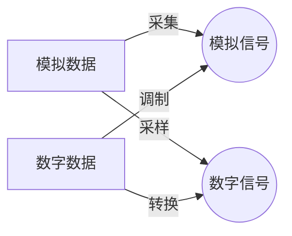

@[toc]

---
总的来说，==物理层的主要功能是将数据链路层中组织成帧的 $0$ 和 $1$ 形成的数据流转换为电磁信号，并通过传输介质以电磁的形式传输数据==。

不是所有对个人或应用程序有用的数据，都能够通过网络进行传输，必须先转换为传输介质可以接受的形式（即电磁信号），传输介质再通过「沿着物理路径传导能量」的方式进行工作。

# 3.1 模拟与数字
数据以及表示数据的信号，都可用模拟 `analog` 或者数字 `digital` 的形式。
## 3.1.1 模拟数据与数字数据
**数据** `data` 可以是模拟的也可以是数字的，即数据可分为模拟数据和数字数据。**模拟数据** `analog data` 指的是**连续状态的信息**，**而数字数据** `digital data` 指的是**离散状态的信息**。
- **模拟数据采用连续值**。例如，人说话时，会在空气中形成模拟形式的声波（模拟数据），通过麦克风采集这个声波并转换成模拟信号，或者对这个声波进行采样转换成数字信号。
- **数字数据采用离散值**。例如，（数字）数据以 $0$ 和 $1$ 的形式存储在计算机内存中，它们可转换成数字信号，也可以调制成模拟信号再通过介质进行传输。

## 3.1.2 模拟信号和数字信号
就像它们表示的数据一样，**信号** `signal` 可以是模拟信号，也可以是数字信号。**模拟信号** `analog signal` 在一段时间内可以有无穷多个取值，有无穷多个强度等级；而**数字信号** `digital signal` 只能有有限个已定义的数值，通常情况下是简单的 $0$ 和 $1$ 。
> 表示信号的**最简单方法**是，**将它们绘制在直角坐标系中，垂直坐标表示信号的值或强度，水平坐标表示时间**。图3.1说明了一个模拟信号和一个数字信号，前者的曲线通过了无穷多个数值点，数字信号的垂直线表示了信号值到值的突变。
> 

## 3.1.3 周期信号与非周期信号
模拟与数字信号都可能以两种形式之一出现：周期信号或者非周期信号。

**周期信号** `periodic signal` 在一个*可测量的时间范围内*（称为一个**周期** `period` ）完成一种模式，并且在后续的*相同时间范围内*重复这一模式。一个完整模式的实现称为一个**循环** `cycle` 。**非周期信号** `nonperiodic signal` 则指，信号的变化不随时间的变化出现重复的模式。

在数据通信中，通常使用**周期模拟信号**和**非周期数字信号**。周期模拟信号需要更少的带宽，而非周期数字信号可以表示数据的变化【第五章】。

---
# 3.2 周期模拟信号
周期模拟信号可以分为**简单类型**、**复合类型**两种。简单类型模拟信号，即**正弦波** `sine wave` ，不能再分解为更简单的信号。而复合型模拟信号则是由多个正弦波信号组成的。

## 3.2.1 正弦波
==正弦波是周期模拟信号的**最基本形式**==。可以看做一条简单的振荡曲线，在一个周期内的变化是平滑的、一致的、*连续的*、起伏的曲线。图3.2表示的就是一条正弦波形。每个循环由时间轴上方的单弧和后跟着的时间轴下方的单弧构成。

==单个正弦波可用三个参数表示：**峰值振幅、频率、相位**。==
- 信号的**峰值振幅** `peak amplitude` 是其最高强度的绝对值，与其携带的能量成比例。对于电信号，峰值振幅常以*伏特*为单位来计量；
- **周期** `period` 是信号完成一个循环所需要的时间，以*秒*为单位。**频率** `frequency` 是指 $1$ 秒内的周期数。注意==周期和频率是按两种方式定义的同一特性==。周期是频率的倒数，频率是周期的倒数，如下列公式所示：
$$f = \dfrac{1}{T} ,\ \ T = \dfrac{1}{f}$$
通常周期用*秒* `s` 表示，频率用*赫兹* `Hz` 表示，它是每秒的循环数。周期和频率的单位如下表所示：

因此，**频率是信号与时间的关系**，而一个波形的频率是一秒钟内完成的周期数，但从另一种角度，我们可把频率看做（**信号对于时间的**）**变化速率的计量单位**。电磁信号是振荡的波形，它们会在平均能量级上下持续而且可预测地波动。所以，尽管将频率描述为每秒内的循环次数，通常也用于计量信号对于时间的变化速率——==变化占用的时间短意味着频率高，变化占用的时间长意味着频率低==。
极端情况下，如果信号始终不变化，即在整个存在的时间内始终保持稳定的电平值，则其频率是 $0$ ，因为信号永远不能完成一个循环。如果信号瞬间发生变化，即信号瞬间由一个电平立即跳变到另一电平，则其频率为无穷大，因为信号的周期是 $0$ ，于是频率等于 $\dfrac{1}{0} = \infin$ 。
- **相位** `phase` 是指波形相对于时间零的位置。将波形想象为能够沿着时间轴向前向后进行平移，则相位描述的就是这种偏移的数量，==它指明了第一个循环开始的状态==。
相位使用*角度*或者*弧度*进行计量（$360\degree$ 等于 $2\pi$ 弧度）。一个 $360\degree$ 的相位偏移（相移）相当于一个完整周期的偏移，$180\degree$ 的相移相当于半个周期的偏移，$90\degree$ 相当于四分之一的偏移。

从图3.5可以看出，相位为 $0\degree$ 的正弦波在零时刻以零振幅开始，然后振幅递增；相位为 $90\degree$ 的正弦波在 $0$ 时刻以峰值振幅开始，然后振幅递减；相位为 $180\degree$ 的正弦波在 $0$ 时刻以零振幅开始，然后振幅递减。
另一种看相位的方式是位移或偏移，可以看出，相位为 $0\degree$ 的正弦波没有位移；相位为 $90\degree$ 的正弦波向左位移 $\dfrac{1}{4}$ 个周期（==零时刻前信号并不真的存在==）；相位为 $180\degree$ 的正弦波向左位移 $\dfrac{1}{2}$ 个周期（==零时刻前信号并不真的存在==）。

【例3.1】家用电源的功率可以用峰值振幅为155V到170V的正弦波表示。但是，大家都知道美国家用的电压是110V到120V。不一样的原因在于这些是均方根(rms)值。信号平方后再计算平均振幅。峰值等于 $2^{½ }× rms$ 。信号 $x_{rms}$ 的计算公式如下：
$$x_{rms} = \sqrt{\dfrac{1}{n} (x_1^2 + x_2^2 + \dots + x_n^2)}$$

【例3.2】电池电压是恒定的，**这个恒定值可以看做是一个正弦波**，我们会在后面看到。例如AA电池的峰值通常是1.5V。

【例3.3】家用电的频率是60Hz。这个正弦波的周期就可以确定
如下：
$$T = \dfrac{1}{f} = \dfrac{1}{60Hz} = 0.0166 \times 10^3ms = 16.6ms$$ 即家用电的周期是 $0.0116s$ 或 $16.6ms$ 。

【例3.4】用微秒表示周期为100ms。
解：从表3.1中可以找出 $1ms$ 的等价值（$1ms = 10^{-3}s$）和 $1s$ 的等价值 $1s = 10^6us$ ，做以下替换：
$$100ms = 100 \times 10^{-3}s = 100 \times 10^{-3} \times 10^6 us = 10^2 \times 10^{-3} \times 10^6 us = 10^5us$$

【例3.5】一个信号的周期是100ms。那么它以千赫为单位表示的频率是多少？
解：先把 $100ms$ 表示为秒，然后从周期计算出频率（$1 Hz =10^{−3} kHz$）：
$$100ms = 100 \times 10^{-3}s = 10^{-1}s\\
f= \dfrac{1}{T} = \dfrac{1}{10^{-1}} Hz = 10Hz = 10\times 10^{-3}kHz = 10^{-2} kHz$$

【例3.6】正弦波相对于 $0$ 时刻的偏移量是 $1/6$ 周期，相位的角度值和弧度值是多少？
解：一个完整的周期是 $360\degree$ ，所以 $1/6$ 周期等于：
$$\dfrac{1}{6} \times 360\degree = 60\degree = 60 \times \dfrac{2\pi}{360} rad = \dfrac{\pi}{3} rad = 1.046rad$$

## 3.2.2 波长
**波长** `wave length` 是信号通过传输介质传播的另一个特性。==波长将简单正弦波的周期或频率，与介质的**传播速度** `propagation speed` 结合在一起==，见图3.6：

信号的频率与介质无关，但**波长取决于频率和介质**。==波长是任何信号的一个属性，是简单信号在一个周期能传播的距离==。在数据通信中，我们一般使用波长来描述光纤中的光传输。

如果给定了传播速度（光速）和信号周期，就可以计算出波长。注意，**波长通常以微米而不是米为单位计量**。用 $\lambda$ 表示波长，用 $c$（光速）表示传播速度，用 $T$ 表示周期（用 $f$ 表示频率），可以得到：$${}\\ 波长 = 传播速度\times 周期 = \dfrac{传播速度}{频率} \\ \lambda = c T = \dfrac{c}{f}$$

电磁信号的传播速度取决于介质（和信号频率），例如在真空中光以 $3\times 10^8 m/s$ 的速度传播，在空气中速度低些，在电缆中速度更低。因此，空气中红光（频率 $= 4\times 10^{14}$）的波长是：$$\lambda = \dfrac{c}{f} = \dfrac{3\times 10^8} { 4\times 10^{14}} = 0.75 \times 10^{-6}m = 0.75 um$$

而在同轴电缆或光纤电缆中，因为传播速度降低了，所以波长更短（$0.5um$）。

## 3.2.3 时域和频域
一个正弦波可通过振幅、频率和相位得到完整的定义，而前面已经用**时域图** `time-domain plot` 表示正弦波，**时域图显示了信号振幅随时间的变化情况**（振幅的时间图）。在时域图中，相位并未显示地表示出来。

为了表示**信号振幅与频率的关系**，可用**频域图** `frequency-domain plot` 表示正弦波。频域图只和峰值振幅与频率相关，不显示一个周期内的振幅变化，图中通过一个尖峰表示时域图中一个完整的正弦波，尖峰的位置表示频率、高度表示峰值振幅。==显然，频域图更容易画，且传递了时域图中能找到的信息==。频域的优点是我们能直接看到频率值和峰值振幅值。

【例3.7】当我们处理多个正弦波时，频域更简洁更有用。例如，图3.8显示了三个不同振幅和频率的正弦波。它们通过频域中的三个尖峰表示。

## 3.2.4 复合信号
目前为止，讨论的都是简单正弦波，单个正弦波在日常生活中有很多应用。但单一频率的正弦波在数据通信中没有用处，因为它不会携带任何信息，我们需要发送复合信号来进行数据通信。**复合信号** `composite signal` 由许多简单正弦波组成。

20世纪早期，[法]数学家 `Jean-Baptiste Fourier` 证明了任何复合信号都是由具有不同频率、相位和振幅的正弦波信号组合而成的，即**傅里叶分析** `Fourier analysis` 。

复合信号可以是周期性的也可以是非周期性的。如果复合后的信号是周期性的，分解得到的是**一系列具有离散频率（频率取整数1、2、3等）的简单正弦波信号的组合**。如果复合后的信号是非周期性的，分解得到的是**具有连续频率（取实数的频率）的无穷个简单正弦波信号的组合**。

【例3.8】图 3.9显示了频率为 $f$ 的周期复合信号。这种信号不是数据通信中的典型信号。我们可以把它看成三个告警系统，每一个有不同的频率。这个信号的分析可以让我们理解如何分解信号。
用人工把这个*周期复合信号*分解成一系列简单正弦波是困难的，但有软硬件工具帮助我们做到，我们只对结果感兴趣。图3.10显示了上面信号的时域和频域中的分解结果。

频率为 $f$ 的正弦波，其振幅几乎和复合信号的峰值振幅一样，其频率和复合信号的频率一样，称之为**基础频率** `fundamental frequency` 或者**第一谐波** `harmonic` ；频率为 $3f$ 的正弦波，其振幅是第一个的三分之一，其频率为基础频率的 $3$ 倍，称为**第三谐波**；频率为 $9f$ 的正弦波，其振幅是第一个的九分之一，其频率为基础频率的 $9$ 倍，称为**第九谐波**。

注意，分解后信号的频率是离散的，频率为 $f,\ 3f,\ 9f$ 。因为 $f$ 是整数，所以 $3f,\ 9f$ 也是整数，没有诸如 $1.2f$ 或 $2.6f$ 的频率。**周期复合信号的频域总是由离散尖峰组成**。

【例3.9】图3.11表示了一个非周期复合信号。它可以在一个或两个词发音时由麦克风或电话机产生。这种情况下，复合信号不可能是周期的，因为我们不可能以完全相同的音调重复相同的词或语句。

我们将其分解为无数个简单正弦波的组合。在这个非周期复合信号的时域表示内，有无数个简单正弦频率。人类语音中的频率数量是无限的，但是范围是有限制的，普通人会产生 $0Hz \sim 4kHz$ 之间的频率。
> 注意：这个非周期复合信号的频率分解后，频域表示中得到的是一条连续曲线。在实数区间 $[0.0, 4000.0]$ 内有无数个实数值频率。为了找到频率为 $f$ 的振幅，可在 $f$ 处画一条垂直线与曲线相交，垂直线的高度就是相应频率的振幅。

## 3.2.5 带宽
==复合信号包含的频率范围称为**带宽** `bandwidth`== 。带宽通常是两个数（信号最高频率和最低频率）的差值。例如，如果一个复合信号包含 $1000$ 到 $5000$ 的频率，它的带宽就是 $5000-1000 = 4000$ 。因此，==两个频率不同的简单正弦波（简单信号）的带宽是相同的，都为零==。

下图给出了两个复合信号，说明了它们的带宽，一个是周期信号而另一个是非周期信号。**周期信号的带宽包含 $1000\sim 5000$ 之间（$1000、1001、1002、\dots$）的所有整数频率。非周期信号的带宽有相同的范围，但频率是连续的**。

【例3.10】如果一个周期信号分解为 $5$ 个正弦波信号，频率分别为 $100,300,500,700$ 和 $900Hz$ ，那么其带宽是多少？假定所有分量的最大振幅都为 $10V$ ，试画出该信号的频谱。
解：设 $f_h$ 为最高频率，$f_l$ 为最低频率，$B$ 为带宽，则：
$$B = f_h - f_l = 900 - 100 = 800(Hz)$$

频谱只有 $5$ 个尖峰，分别位于 $100,300,500,700$ 和 $900Hz$ 的位置（见图3.13）。
【例3.11】一个周期信号的带宽是 $20Hz$ ，其最高频率是 $60Hz$ ，最低频率是多少？如果信号包含具有相同振幅的所有整数频率，试画出其频谱。
解：设 $f_h$ 为最高频率，$f_l$ 为最低频率，$B$ 为带宽，则：
$$B = f_h - f_l \Rarr 20 = 60 - f_l \Rarr f_l = 60 - 20 = 40Hz$$

频谱包含所有整数频率。用一系列尖峰表示（见图3.14）。

【例3.12】一个非周期复合信号的带宽为 $200kHz$ ，中间频率为 $140kHz$ ，峰值振幅为 $20V$ 。两个频率极值的振幅为 $0$ 。画出这个信号的频域。
解：最低频率一定是 $40kHz$ ，而最高频率一定是 $240kHz$ 。图3.15显示了频域和带宽。

【例3.13】非周期复合信号的一个例子是调幅（AM）无线电站传播的信号。在美国，分配给每个AM无线电站 $10kHz$ 的带宽。AM无线电的总带宽从 $530kHz$ 到 $1700kHz$ 。我们会在第5章说明这个 $10kHz$ 带宽后面的基本原理。

【例3.14】非周期复合信号的另一个例子是调频（FM）无线电站传播的信号。在美国，分配给每个FM无线电站 $200kHz$ 的带宽。FM无线电的总带宽从 $88MHz$ 到 $108MHz$ 。我们会在第5章说明这个 $200kHz$ 带宽后面的基本原理。

 【例3.15】非周期复合信号的另一个例子是老式**模拟黑白电视**接收的信号。电视屏幕由像素组成。如果我们假定分辨率为 $525 × 700$ ，那么每个屏幕就会有 $367,500$  个像素。如果屏幕每秒扫描 $30$ 次，每秒就是 $367,500 × 30= 11,025,000$ 个像素。最坏的情况是黑色像素和白色像素交替。**我们用最低振幅表示一种颜色，而用最高振幅表示另一种颜色，每个周期我们能发送两个像素**。因此，每秒我们需要 $11,025,000 / 2 = 5,512,500$ 个周期(或 $Hz$ )。所需的带宽是 $5.5125 MHz$ 。最坏情况发生的可能性很小，假定只需要这个带宽的 $70\%$ ，即 $3.85MHz$ 。因为还需要音频和同步信号，我们还为每个黑白电视频道留出了 $4MHz$ 带宽。此外，模拟彩色电视频道的带宽为 $6MHz$ 。

---
# 3.3 数字信号
==数字/模拟数据除了可以用模拟信号表示外，还可以使用数字信号表示==。例如，$1$ 可以编码为正电平，$0$ 可以编码为零电平。**一个数字信号可以有多于两个已定义的数值（即多于两个电平），在这种情况，每个电平就可以发送多个位（即代表的数值更大）**。图3.16表示了两个信号，图a的信号有两个电平，每个电平可发送一位（分别代表 $0, 1$），图b的另一个信号有四个电平，每个电平可发送 $2$ 位（分别代表 $00, 01, 10, 11$）：

一般来说，==如果（数字）信号有 $L$ 个电平，则每个电平可发送 $\log_2L$ 个bit位。==

【例3.16】一个数字信号有 $8$ 个电平。那么每个电平需要多少个位？我们根据下面公式进行计算：$$\textrm{Number of bits per level} = \log_2 8 = 3$$

每个信号电平用 $3$ 位表示；或者说，每个信号电平可以携带 $3bit$ 的信息。

【例3.17】一个数字信号有 $9$ 个电平，问每个电平可表示多少位？我们根据公式计算，得出每个信号电平用 $3.17$ 个位表示。但是，这个答案是不现实的。每个电平发送的位数必须是整数并且是 $2$ 的幂。这个例子中，$4$ 位用来表示一个电平。

## 3.3.1 比特率
==大多数数字信号都是非周期的，这样周期和频率就不再适用，而用**比特率**（而不是频率）来描述数字信号==。**比特率** `bit rate` 是一秒中发送的位数，以*每秒位* `bit per second, bps` 表示。图3.16表示了两个信号的比特率。

【例3.18】假定我们需要以每分钟 $100$ 页的速率下载文本文档。所需的通道比特率是多少（一页平均 $24$ 行，每一行 $80$ 个字符）? [UGC-NET | UGC NET CS 2016 July – III | Question 29](https://www.geeksforgeeks.org/ugc-net-ugc-net-cs-2016-july-iii-question-29/)
解：如果我们假定每个字符需要 $8$ 位，比特率：
$$(100 \times 24 \times 80 \times 8) / 60 =  25 600 bps = 25.6kbps$$

【例3.19】我们会在第4章中看到，**数字化语音通道**是通过**数字化** $4kHz$ 带宽的模拟语音信号形成的。我们需要以最高频率的 $2$ 倍对信号进行**采样**（即每赫兹两个样本）。我们假定每个样本需要 $8$ 位。那么所需的比特率是多少？
解：比特率计算如下：
$$4kHz \times 2 \times 8 = 64000 bps = 64kbps$$

【例3.20】高清晰电视（HDTV）的比特率是多少?
解：HDTV使用数字信号广播高质量视频信号。HDTV屏幕通常为 $16 : 9$ 。每屏有 $1920 × 1080$ 个像素,每秒刷新 $30$ 次。$24$ 位代表一种颜色像素。我们计算比
特率如下：
$$1920 \times 1080 \times 30 \times 24 = 1,492,992,000\ or \ 1.5Gbps$$

电视台通过压缩把比特率降为 $20Mbps$ 到 $40Mbps$ 。

## 3.3.2 位长
我们已经讨论过**模拟信号的波长**概念：**一个周期在传输介质上传播的距离**。现在为数字信号定义相似的概念：位长。**位长** `bit length` 是**一个位在传输介质上传播的距离**。
$$位长 = 传播速度\times 位持续时间$$

## 3.3.3 数字信号是一种复合模拟信号
基于傅里叶分析，数字信号是一种复合模拟信号。正如你猜想的（？），带宽是无穷大的。考虑一个数字信号时，可以直观了解这个概念。在时域中，数字信号由连接的垂直和水平线段组成。时域中的垂直线表示为无穷大的频率（随时间突变），时域中的水平线表示为 $0$ 的频率（不随时间变化）。从频率 $0$ 变到频率无穷大（以及反之），暗示两者间的所有频率都是域的一部分，所以整体带宽是无穷大。

**傅里叶分析可以用来分解数字信号**。如果数字信号是周期性的（在数据通信中较少见），则分解后的信号可以表示为**无穷大带宽和离散频率的频域**；如果数字信号是非周期的，则分解后的信号仍然是**无穷大带宽，但频率是连续的**。图3.17显示了周期数字信号和非周期数字信号以及它们的带宽。

## 3.3.4 数字信号的传输
前面的讨论断言，**数字信号（周期性或非周期性）是由零到无穷大范围内的频率组合成的复合模拟信号**。对于下面的讨论，我们假定是**非周期数字信号**的情况，类似于在数据通信中常见的信号。基本问题是「我们如何从 $A$ 点发送数字信号到 $B$ 点」？我们使用两种不同的方法传输数字信号：基带传输和宽带传输（使用调制）。

### 1. 基带传输
基带传输就是**通过通道发送数字信号，该信号不转换成模拟信号**。图3.18表示了**基带** `baseband` 传输。

==基带传输需要一个带宽下限频率为 $0$ 的**低通通道** `low-pass channel` ，即带宽从 $0$ 开始的通道。如果我们的**带宽只组成一条通道的专用介质**（即专用通道），就是这种情况==。例如，连接两台计算机的电缆的整个带宽就是一条单通道。另一个例子，我们可以连接多台计算机到一条总线上，但不允许同一时刻超过两个站进行通信。==我们有低通通道，就可以用它来进行基带传输==。图3.19显示了两条低通通道：一条是窄带宽的，另一条是宽带宽的。要记住==无穷大带宽的低通通道只是理想情况，我们不可能在现实中有这样的通道，但是我们可以接近==。

下面考察基带传输的两种情况：宽带宽的低通通道和有限带宽的低通通道。

#### 情形1：宽带宽的低通通道
如果我们想保持（垂直段垂直而水平段水平的）非周期数字信号的准确形式，需要发送整个频谱（零和无穷大之间频率的连续范围）。==如果我们在发送方和接收方之间有一条无穷大带宽的专用介质，它保持了复合信号中每个成分的准确振幅，这就是可能的==。虽然这在计算机里是可能的（比如在CPU和内存之间），但在两个设备间是不可能的。

幸运的是，带宽边界的频率振幅太小以至于可以忽略不计。这意味着==如果我们的介质具有很宽的带宽（比如同轴电缆或光纤），两个站就可以使用具有非常高准确性的数字信号进行通信==，如图3.20所示，注意 **$f_1$ 接近于 $0$ 而 $f_2$ 很大**。

即**只有我们有无穷大或非常大带宽的低通通道，保持数字信号形状的数字信号基带传输才是可能的**。对于后者，虽然输出信号不是原始信号的严格复制品，但是仍然可以从接收到的信号中得出数据。注意，虽然一些频率会被介质阻止，但它们不是主要的。

【例3.21】专用通道（**介质的整个带宽用于一条单通道**）的一个例子是LAN。几乎现在的每一个有线LAN，都会使用专用通道用于两个站之间的互相通信。**在多点连接的总线拓扑结构LAN中，每个时刻只有两个站可以互相通信（时间共享），而其他站限制发送数据**。**在星型拓扑结构LAN中，每个站和集线器之间的整个通道用于这两个实体间的通信**。我们会在第14章学习LAN。

#### 情形2：有限带宽的低通通道
**在有限带宽的低通通道中，我们把数字信号近似成模拟信号，近似程度取决于可用的带宽**。这也说明，比较困难的是，不存在近似无穷大带宽的信道来传输标准波形的数字信号，所以只能传输近似的模拟信号来企图表示数字信号。

**大致近似** 让我们假定有比特率为 $N$ 的数字信号，如果我们想发送模拟信号来大致近似这个信号，需要考虑最坏情况，即数字信号中变化的最大数。这发生在信号携带了序列 `01010101...` 或者序列 `10101010...` 。

为了模拟这两种情况，需要频率 $f = N/ 2$ 的模拟信号，$1$ 为正尖峰值，$0$ 为负尖峰值，每个周期发两位，那么模拟信号的频率是这个比特率的一半，即 $N / 2$（即一秒 $N/2$ 个周期）。但是，只有这个频率不能模拟出所有的模式，我们需要更多的成分。最大的频率是 $N/2$ 。

作为这个概念的一个例子，先看看如何使用模拟信号模拟 $3$ 位模式的数字信号。图3.21说明了这个概念：
- 对两个相似情形（$000$ 和 $111$），$000$ 用频率 $f = 0$ 、相位为 $180\degree$ 的信号模拟，$111$ 用频率 $f = 0$ 、相位为 $0\degree$ 的信号模拟。
- 对于两个最坏情形（$010$ 和 $101$），$010$ 用频率 $f = N / 2$ 、相位为 $180\degree$ 的信号模拟，$101$ 用频率 $f = N/ 2$、相位为 $0\degree$ 的信号模拟。
- 其他四种情形用 $f = N/ 4$ 、相位分别为 $180\degree,\ 270\degree,\ 90\degree,\ 0\degree$ 的信号模拟。

- 总之，我们需要能处理频率 $0,\ N/4,/ N/2$ 的通道。这个大致近似称为**第一谐波** $N / 2$ 频率。所需的带宽是：
$$带宽 = \dfrac{N}{2} - 0 = \dfrac{N } {2}$$

**更好近似** 为了使得模拟信号的形状更像数字信号，我们需要增加频率的更多谐波。我们需要增加带宽。可以增加带宽到 $3N / 2,\ 5N/2,\ 7N/2$ 等。图3.22说明了这种增加对于一种最坏情形（模式 $010$）的影响。

注意，我们显示的只是每个谐波的最高频率。我们使用第一、第三和第五谐波。（第五谐波）所需的带宽现在是 $5N/2$ ，即最低频率 $0$ 和最高频率$5N/2$ 之间的差值。需要记住，==在基带传输中，**所需带宽与比特率成正比，如果我们需要更快地发送位，则需要更大的带宽**==。同样比特率的情况下，叠加更多谐波，其合成后的模拟信号越近似于数字信号，则需要更宽的带宽，**尽管比特率没有增加，但更容易识别信号**。

通过这种方法，表3.2显示了我们以不同速率发送数据所需的带宽：

【例3.22】如果我们需要使用基带传输发送 $1 Mbps$，那么低通通道所需的带宽是多少？
解：答案取决于**所需的准确性**：
- 最小带宽、大致近似，是 $B = 比特率/2 = 500 kHz$ 。我们需要 $0\sim 500kHz$ 范围频率的低通通道。
- 使用第一和第三谐波可以得到更好的结果，所需带宽是 $B  = 3 × 500 kHz = 1.5 MHz$ 。
- 使用第一、第三和第五谐波仍然可以得到更好的结果，所需带宽是 $B = 5 × 500 kHz = 2.5 MHz$ 。

反过来，==如果使用同样的带宽，第一谐波得到的比特率最大，为 $N = 2B$ ；使用第一、第三谐波得到的比特率其次，为 $N = \dfrac{2B}{3}$ ；使用第一、第三、第五谐波得到的比特率最低，为 $N = \dfrac{2B}{5}$== 。

【例3.23】我们有一条带宽为 $100kHz$ 的低通通道。那么这条通道的最大比特率是多少？
解：==**如果我们使用第一谐波，就可以得到最大比特率**==。比特率是2倍有效带宽，即 $200kbps$ 。

### 2. 宽带传输（使用调制）
**宽带传输或调制 `modulation` ，就是把数字信号转换为模拟信号传输**。调制允许我们使用**带通通道** `bandpass channel` ，即**带宽不从 $0$ 开始的通道**。这种通道比低通通道更可用，==低通通道可以看做是较低频率从 $0$ 开始的带通通道==（而且是专用的）。图3.23显示了带通通道：

==如果可用通道是带通通道，我们不能直接发送数字信号到通道；我们需要在传输前把数字信号转换成模拟信号。==

图3.24则说明了数字信号的调制过程。在该图中，**（发送方将）数字信号转换为复合模拟信号**。我们使用单频率模拟信号（称为**载波**），已经改变的载波振幅使其看起来像数字信号。但是，结果不是单频率信号，*它是复合信号*，正如在第5章中看到的。**在接收方，接受到的模拟信号转换为数字信号，结果是被发送信号的复制品**。

【例3.24】**使用调制的宽带传输**的一个例子，是通过电话用户线传输计算机数据，电话用户线连接住所到中心电话局。这些线路在许多年前就安装了，设计用有限带宽（$0\sim 4kHz$ 间的频率）承载语音（模拟信号）。虽然这个通道能用做低通通道，但是通常被看做**带通通道**。一个原因是**带宽太小** $4kHz$ ，以至于如果我们把它当做低通通道用于基带传输，那么最大的比特率只有 $8kbps$ 。

解决方案是 ==**把它看做带通通道**，从计算机把数字信号转换成复合模拟信号，然后发送模拟信号==。我们要安装两个转换器，用来在发送端把数字信号转换成模拟信号、以及在接收端把模拟信号转换回数字信号。在这种情况下，转换器称为**调制解调器**（调制器/解调器），在第5章更详细地讨论调制解调器。

【例3.25】第二个例子是数字蜂窝电话。为了更好地接收，数字蜂窝电话**把模拟信号转换成数字信号**（见第16章）。虽然分配给公司提供数字蜂窝电话服务的带宽很广，但是我们不能不经转换发送数字信号。原因是，**在主叫方和被叫方之间只有一条可用的带通通道**。需要在发送前把数字信号转换成复合模拟信号。

例如，如果有效带宽是 $W$ ，并且我们允许 $1000$ 对用户同时交谈，这意味着有效带宽是 $W/1000$ ，只是整个带宽的一部分。我们需要在发送前，将数字信号转换为复合模拟信号。**而数字蜂窝电话先把模拟音频信号转换为数字信号，然后再把数字信号转换成模拟信号，以通过带通通道传输。**

---
# 3.4 传输减损
信号通过介质进行传输，但是其传输并非是完美无缺的。不完美的地方导致了信号减损。这意味着信号在介质的开始一端和结束一端是不相同的。发送的信号并非就是接收到的信号。==通常会发生三种类型的减损：衰减、失真和噪声==（见图3.25）。

## 3.4.1 衰减（能量的损失）与分贝
**衰减** `attenuation` 意味着**能量的损失**。==当某种简单或复合的信号通过某种介质传输时，它会失去一些能量用于克服介质的阻抗==。这是为什么传输电信号的电缆会发热，如果不热，过一段时间也会发热。信号中的电能转换为热能。**为了补偿能量损失，用放大器放大信号**。图3.26说明了衰减与放大的效果。为了说明信号损失或增益的强度，工程上使用分贝的概念。*分贝* `decibel, dB` 用于计算两种信号之间或者同一信号在两个不同位置之间的**相对强度**。==若信号衰减了，则分贝为负值；若信号被放大了，则分贝为正值==。设 $P_1, P_2$ 分别是信号在位置 $1$ 和位置 $2$ 的**功率**：
$$dB = 10 \log_{10} \dfrac{P_2}{P_1}$$

注意一些工程书籍中以电压而非功率定义分贝，这种情况下，因为**功率与电压的平方成正比**，所以公式变为：
$$dB =  10 \log_{10} \dfrac{P_2}{P_1} =  10 \log_{10} \dfrac{V_2^2}{V_1^2} = 20\log_{10} \dfrac{V_2}{V_1}$$

【例3.26】假设信号通过一种传输介质传输后，它的功率降低了一半。这可以表示为 $P_2=(1/2)P_1$ ，这种情况下衰减（损失的能量）可以计算为：
$$dB = 10 \log_{10} \dfrac{P_2}{P_1} = 10\log_{10} \dfrac{1}{2} = 10 \times (-0.3) = -3dB$$

$-3dB$ 或衰减 $3dB$ ，等价于功率损失了一半。

【例3.27】假定信号通过一个放大器，它的功率增大为原来的 $10$ 倍。这表示 $P_2 = 10P_1$ 。在这种情况下，放大量（功率增益）可以计算为：
$$dB = 10\log_{10} \dfrac{P_2}{P_1} = 10\log_{10} 10 = 10dB$$

【例3.28】==工程人员使用分贝来计算信号强度变化的原因之一是，当涉及计量多处（级联）而不仅仅是两处的信号强度时，分贝数可以相加（或相减）==。在图3.27中，一个信号从位置 $1$ 传输到位置 $4$ ，信号在到达位置 $2$ 时衰减了，在位置 $2$ 和 $3$ 之间信号被放大，在位置 $3$ 和位置 $4$ 之间信号再次衰减。只需要将各位置之间的分贝值相加，就可以得到信号最终的分贝数。

在这种情况下，分贝可以计算为：
$$dB = -3 + 7 - 3 = 1$$ 表示信号的功率增大了。

【例3.29】有时候分贝用来以毫瓦计量信号功率。这种情况下，它成为 $dB_m$ ，计算为 $dB_m = 10 \log_{10} P_m$ , 这里 $P_m$ 是以毫瓦为单位的功率。如果信号的功率为 $dB_m = −30$ ，计算它的功率。
解：我们计算信号的功率如下：
$$dB_m = 10\log_{10} P_m = -30\\ 
\log_{10} P_m = -3 \\
P_m = 10^{-3} mW
$$

【例3.30】电缆中的损耗一般定义为每公里分贝数（$dB/km$）。如果电缆每公里分贝数为 $−0.3 dB/km$ ，信号在电缆开始端的功率为 $2 mW$ ，则在 $5 km$ 处信号的功率是多少？
解：==电缆中的损耗为 $5 × (−0.3) = −1.5 dB$== 。我们计算功率如下：
$$dB = 10\log_{10} \dfrac{P_2}{P_1}= -1.5dB \\
  \dfrac{P_2}{P_1} = 10^{-0.15} = 0.71 \\
 P_2 = 0.71P1 = 0.71 \times 2 = 1.42mW$$

## 3.4.2 失真（信号改变了形态）
**失真** `distortion` 意味着**信号改变了形态或形状**。==失真产生在由不同频率成分组成的复合信号当中，**每一种信号成分在通过介质时有自己的传播速度**（见3.5节），所以到达最终目的节点时有各自的延迟，**如果延迟与周期时间不完全一致**，那么延迟的差异就会产生相位的差异==。即，接收方的信号成分与发送方的信号成分存在相位差异。因此，复合信号的形状会不一样。图3.28说明了复合信号中失真的影响。

## 3.4.3 噪声与信噪比
**噪声** `noise` 是另一个减损原因。有几种类型的噪声，如热噪声、感应噪声、串扰和脉冲噪声，都会损害信号：
- 热噪声是电缆中的电子随机移动而产生的额外信号，而不是信号发送装置发送的；
- 感应噪声的来源是发动机和设备，这些设备工作时相当于发射天线，而传输介质成为接收天线。
- 串扰则是电缆之间的互相影响。一根电缆作为发射天线而另一根电缆作为接收天线。
- 脉冲噪声是一种尖峰信号（在非常短时间内有很高能量的一种信号），来自输电线、闪电等。

图3.29说明了信号中噪声的影响。在第10章内讨论差错。

 随后会看到，为了找到理论上的比特率限制，需要知道**信号功率与噪声功率的比率**。**信噪比** `signal-to-noise ratio` 定义如下： $${} \\ SNR = \dfrac{平均信号功率}{平均噪声功率}$$

我们需要考虑平均信号功率和平均噪声功率，因为这些会随时间变化。图3.30说明了 $SNR$ 的概念。==$SNR$ 实际上是我们需要的（信号）和我们不需要的（噪声）之间的比率==。较高的 $SNR$ 意味着**信号较少地被噪声破坏**，较低的 $SNR$ 意味着**信号被噪声更多地破坏**：

如果给出的是信号峰值电压和噪声峰值电压，则 $$SNR = \dfrac{(signal\ voltage)^2 } {(noise\ voltage)^2}$$
 
==因为 $SNR$ 是两个功率的比率，所以一般用分贝单位描述==。$SNR_{dB}$ 定义如下： $$SNR_{dB} = 10\log_{10} SNR$$

【例3.31】信号的功率是 $10 mW$ ，噪声的功率是 $1 μW$ ，那么 $SNR$ 和 $SNR_{dB}$ 是多少？
解：$SNR$ 和 $SNR_{dB}$ 可以计算如下:
$$
SNR = \dfrac{10mW}{1 \mu W} = \dfrac{10000\mu W}{1\mu W} = 10000 \\ {} \\
SNR_{dB} = 10\log_{10} 10000 = 40
$$

【例3.32】对于无噪声通道的 $SNR$ 和 $SNR_{dB}$ 是：
解：我们在现实中不会得到如下的比率，它是理论上的。
$$
{} \\
SNR = \dfrac{信号功率}{0} = \infin \\
SNR_{dB} = 10\log_{10} \infin = \infin 
$$ 

---
# 3.5 数据速率限制
数据通信中一个非常重要的问题是：**在一个通道中能够以多快的速率发送数据**，即每秒钟的比特数。数据速率取决于三种因素：
1. 有效带宽：**带宽越宽，第一谐波频率越高，速率越快**
2. 使用的信号电平数：$\log_2 L$
3. 通道的质量：噪声电平 $SNR$ 、叠加谐波的个数

有两个重要的理论公式，用于计算数据速率：一个是由奈奎斯特提出的**奈奎斯特比特率**，用于无噪声通道；另一个是由香农提出的**香农容量定理**，用于噪声通道。

## 3.5.1 无噪声信道：奈奎斯特比特率:star:
对于无噪声通道，**奈奎斯特比特率** `Nyquist bit rate` 定义了理论上的最大比特率：
$$比特率= 2 \times 带宽 \times \log_2L \\
R_{bits} = 2\cdot B \cdot \log_2 L$$ 公式中，带宽指通道的带宽，$L$ 是用于表示数据的（数字）信号电平的数量，比特率是每秒中的位数。

根据这一公式，我们可以认为：==给定特定的带宽，可以通过增加信号电平数获得任何我们想要的比特率==。虽然这一思想在理论上是正确的，但是实际上有局限。当我们增加了信号电平数时，我们增加了接收方的负担——如果（数字）信号的电平数是 $2$ ，接收方可以轻易分出 $0$ 和 $1$ ；如果信号的电平数是 $64$ ，接收方必须很复杂才能区分出 $64$ 个不同的电平。换言之，**增加信号电平数减弱了系统的可靠性**。

【例3.33】奈奎斯特公式是否适用于基带传输中描述的直觉上的比特率？
解：**当只有两个电平时它们匹配**。在基带传输中，如果在最坏情况只使用第一谐波，那么比特率是2倍带宽。但是，==奈奎斯特公式比我们直觉上得到的更通用，它可以应用到基带传输和（宽带传输）调制，也可以应用到有两个或多个信号电平的情况。==

【例3.34】考虑带宽为 $3000Hz$ 的无噪声通道，传输两种电平的信号，则最大比特率计算为：
$$BitRate = 2 \cdot 3000Hz \cdot \log_2 2 = 6000 bps$$

【例3.35】考虑同样的无噪声通道，传输具有四种信号电平的信号（每一种电平发送两个位）。最大比特率可以计算为：
$$BitRate = 2 \cdot 3000Hz \cdot \log_2 4 = 12000 bps$$

【例3.36】通过带宽为 $20kHz$ 的无噪声通道发送比特率为 $265kbps$ 的数据，需要多少信号电平？
解：使用奈奎斯特公式如下：
$$265 000 = 2 \times 20 000 \times \log_2 L\\
\log_2L = 6.625 \\ L = 2^{6.625} = 98.7 个电平
$$ 因为结果不是 $2$ 的幂，所以需要增加电平数或者减小比特率。如果有 $128$ 个电平，比特率是 $280kbps$ 。如果有 $64$ 个电平，比特率是 $240kbps$ 。

## 3.5.2 噪声通道：香农容量定理:star:
实际情况中，不可能有无噪声通道，通道总是有噪声的。1944年，`Claude Shannon` 引进了一个公式，称为**香农容量定义** `Shannon Capacity` ，能够确定噪声通道理论上的最高数据速率：
$$通道容量 =带宽\times \log_2 (1 + SNR)\\
C = B\cdot \log_2(1+SNR)
$$  公式中，带宽是指通道的带宽，$SNR$ 是信噪比，通道容量是指通道的传输容量，即每秒的比特数。注意：==香农公式中没有指出信号电平，这意味着无论使用多少个电平，都不可能获得比通道容量更高的数据速率==。换句话说，公式定义了通道的特性，而不是传输方式。

香农公式表明了以下几点：
◼ **信道的带宽或信道中的信噪比越大，则信息的极限传输速率就越高**。
◼ 只要信息传输速率低于信道的极限信息传输速率，就一定可以找到某种办法来实现无差错的
传输。
◼ 若信道带宽 $B$ 或信噪比 $SNR$ 没有上限（当然实际信道不可能是这样的），则信道的极限信息传输速率 $C$ 也就没有上限。
◼ 实际信道上能够达到的信息传输速率要比香农的极限传输速率低不少。

奈氏准则和香农公式在数据通信系统中的作用范围，如下图所示：

【例3.77】考虑一个极端的噪声通道，其信噪比的值接近于 $0$ 。换句话说，噪声很强而信号很弱，对于该通道，其容量 $C$ 计算为：
$$C = B \log_2 (1 + SNR) = B\log_2 (1 + 0) = B\log_2 1 = 0$$

这意味着通道的容量为 $0$ ，与带宽无关。换句话说，通过该通道不能接收到任何数据。

【例3.38】可以计算一条常规电话线路理论上的最高比特率。通常情况下，电话线路的带宽为 $3000Hz$ 。信噪比通常为 $3162$ 。对于这一通道，其容量计算为：
$$C = B\log_2 (1 + SNR) = 3000Hz \times \log_2 (1 + 3162) = 3000 \times 11.62 = 34860bps$$

这表示电话线路的最高比特率是 $34,860 bps$ 。如果要使数据发送速率比这更快，则可增大线路的带宽或者提高信噪比。

【例3.39】**信噪比通常以分贝给定**。假定 $SNR_{dB} = 36$ ，通道带宽是 $2 MHz$ 。理论上的通道容量计算为：
$$\begin{aligned}
&SNR_{dB} = 10 \log_{10} SNR \\
\Rarr &SNR = 10^{SNR_{dB} /10} \Rarr SNR= 10^{3.6} = 3981 \\ 
C = B\log_2 (1+ &SNR) = 2\times 10^6 \times \log_2 3982 = 24Mbps
\end{aligned}
$$

【例3.40】为了实际操作方便，==当 $SNR$ 很大时，假定 $SNR + 1$ 几乎与 $SNR$ 相等，理论通道容量可以简化为==：
$$C = B\times \dfrac{SNR_{dB}} {3}$$  例如，我们可以计算前一例子的理论容量为：$$C = 2MHz \times \dfrac{36}{3} = 24Mbps$$

【例3.41】有一个 $1MHz$ 带宽的通道。通道的信噪比是 $63$ ，合适的比特率以及信号电平是多少？
解：首先，使用香农公式确定上限：
$$C = B \log_2 (1+SNR) = 1MHz \times \log_2 64 = 6Mbps$$ 尽管香农公式计算结果是 $6 Mbps$ ，但这是上限。为了获得更好的性能，可选择低一些的值，如 $4Mbps$ ，然后使用奈奎斯特公式计算信号电平的数量：$$4Mbps = 2\times 1MHz \times \log_2 L \Rarr L = 4个$$

由此可见，==香农容量定理给出数据速率的上限，奈奎斯特公式给出所需的信号电平数。==

---
# 3.6 性能
到目前为止，我们已经讨论了**在网络上传输数据（信号）的工具**，以及**如何传输数据**（在第4、5、6章会详细讨论）。此外，网络中的一个重要问题是**网络的性能**（在第21章会更详细地讨论服务质量、网络性能的整体衡量），这一节中仅介绍以后章节会用到的术语。

## 3.6.1 带宽
衡量网络性能的一个特性就是**带宽**。网络中，我们常常在两种不同情况下使用术语带宽，且使用的是不同的衡量值：**以赫兹计量的带宽**和**以比特数计量的带宽**。
- 前者已经讨论过。以*赫兹* `Hz` 衡量的带宽指**复合信号包含的频率范围**或者**通道能通过的频率范围**。例如，我们可以说用户电话线的带宽是 $4kHz$ 。
- 带宽还可以指**通道、链路或者网络中每秒能发送的位数**。例如，我们可以说快速以太网（或者这种网络中的链路）的带宽最高达 $100Mbps$ 。这意味着这种网络能发送 $100Mbps$ 。
- 在这两者之间有明显的关系。基本上，==以赫兹衡量的带宽的增长意味着以每秒比特数衡量的带宽的增长==。它们之间的关系，还要取决于是否基带传输或者调制传输等。在第4章、第5章中讨论这个关系。

【例3.42】用于语音或数据的用户线带宽是 $4 kHz$ 。**使用复杂的调制解调器把数字信号转换成模拟信号**，这种线路用于数据传输的带宽可以达到  $56,000bps$ 。

【例3.43】如果电话公司提高线路的质量，把带宽增加到 $8 kHz$ ，通过【例3.42】提到的相同技术，可以发送 $112,000 bps$ 。

带宽应用的领域非常多，可以用来标识信号传输的数据传输能力、标识单位时间内通过链路的数据量、标识显示器的显示能力。
1. 在模拟信号系统又叫频宽，是指在固定的时间可传输的资料数量，亦即在传输管道中可以传递数据的能力。通常以每秒传送周期或赫兹 `Hz` 来表示。
2. 在数字设备中，带宽指单位时间能通过链路的数据量。通常以 `bps` 来表示，即每秒可传输之位数。

## 3.6.2 吞吐量
**吞吐量** `throughput` 用于衡量通过网络发送数据的快慢。虽然第一感觉上，以每秒位数衡量的带宽和吞吐量看起来一样，但是它们是不同的。一条链路可以有 $B\ bps$ 的带宽，但是我们只能通过这条链路发送 $T\ bps$ ，$T$ 永远小于 $B$ 。即，==带宽是链路的潜在衡量值，而吞吐量是发送速度快慢的实际衡量值。== 例如，我们可以有一条带宽为 $1Mbps$ 的链路，但是连接到链路末端的设备只能处理 $200kbps$ ，这意味着我们不能通过这条链路发送数据快于 $200kbps$ 。 

想象一下，一条高速公路设计从一点到另一点每分钟运送 $1000$ 辆汽车。但是如果在路上有拥塞，这个数字会降低到每分钟 $100$ 辆汽车。带宽仍然是每分钟 $1000$ 辆汽车，而吞吐量是每分钟 $100$ 辆汽车。

【例3.44】带宽为 $10Mbps$ 的网络每分钟只能平均传输 $12,000$ 个帧，每个帧平均携带 $10,000$ 个位。那么这个网络的吞吐量是多少？
解：可以计算吞吐量为：
$$\textrm{Throughput} = \dfrac{12000 \times 10000} { 60} = 2Mbps$$ 这个例子中的吞吐量几乎是带宽的五分之一。
## 3.6.3 延迟
延迟定义了**第一个位从源开始发出，到整个报文完全到达目标所经历的时间**。延迟由四个部分组成：**传播时间** `propagation time` 、**传输时间** `transmission time` **排队时间** `queuing time` 、**处理延迟** `processing delay` 。
$$延迟=传播时间+ 传输时间 + 排队时间+处理延迟$$

### 1. 传播时间
传播时间衡量**一个位从源传输到目标所需的时间**。传播时间通过距离除以传播速度计算所得。电磁信号的传播速度取决于介质和信号频率。例如，在真空中，光以速度 $3\times 10^8m/s$ 传播。它在空气中速度较低，在电缆中更低。
$$传播时间 = 距离/传播速度$$

【例3.45】如果两点之间的距离是 $12,000 km$ ，传播时间是多少？假定电缆中的传播速度是 $2.4 × 10^8 m/s$ 。
解：可以计算传播时间为：
$$\textrm{Propagation\ time} = \dfrac{12000 \times 1000} { 2.4 \times 10^8} = 50ms$$ 这个例子说明如果源和目标之间有直接电缆，一个位经过大西洋只需要 $50 ms$ 。

### 2. 传输时间
在数据通信中我们不只发送一个位，我们需要发送报文。第一个位可能会花费跟传播时间相等的时间到达目标，最后一个位也可能需要相同的时间。但是，在第一个位离开发送方到最后一个位到达接收方之间有个时间。第一个位较早离开、到达也较早，最后一个位较晚离开、也较晚到达。**传输一个报文所需时间，取决于报文的长度和通道的带宽**。
$$传输时间 = 报文长度 / 带宽$$

【例3.46】如果网络的带宽是 $1 Gbps$ ，那么 $2.5KB$ 的报文（一封电子邮件）的传播时间和传输时间是多少？假定发送方和接收方之间的距离是 $12,000 km$ ，光以速度 $2.4 ×10^8 m/s$ 传输。
解：计算传播时间和传输时间为：
$$\textrm{Propagation\ time} = \dfrac{12000 \times 1000} { 2.4 \times 10^8} = 50ms \\  {} \\
\textrm{Transmission time} = \dfrac{2500 \times 8}{10^9} = 0.020ms
$$    在这个例子中，因为报文较短而带宽较高，主导因素是传播时间而不是传输时间。传输时间可以忽略不计。

【例3.47】如果网络带宽是 $1 Mbps$ ，那么 $5M$ 字节的报文（一张图像）的传播时间和传输时间是多少？假定发送方和接收方之间的距离是 $12,000 km$，光以速度 $2.4 × 10^8 m/s$ 传输。
解：计算传播时间和传输时间为：
$$\textrm{Propagation\ time} = \dfrac{12000 \times 1000} { 2.4 \times 10^8} = 50ms \\  {} \\
\textrm{Transmission time} = \dfrac{5000 000 \times 8}{10^6} = 40s
$$     注意这个例子中，因为报文较长而带宽不是很高，所以主导因素是传输时间而不是传播时间。传播时间可以忽略不计。
### 3. 排队时间
延迟中的第三个成分是排队时间，即**每个中间或端设备在处理报文前，保持报文所需的时间**。排队时间不是固定因素，它会根据网络负载而改变。当网络上负载较重时，排队时间增长。一个中间设备（如路由器）对到达报文进行排队，然后一个接一个处理。如果有许多报文，每个报文就不得不等待。

## 3.6.4 带宽与延迟的乘积（时延带宽积）
带宽和延迟是链路的两个性能度量，但是正如以后看到的，数据通信中十分重要的是二者的乘积。下面使用两个假想情形作为例子，详细阐述这个问题。

情形一如下。假设有一条带宽为 $1bps$ 的链路，还假定链路的延迟为 $5s$（两个不现实的假设）。我们想看这个情形中，时延带宽积意味着什么。从图中，我们可以说这个乘积 $1\times 5$ 是能够充满链路的最大位数，链路上在任何时候都不可能多于 $5$ 位。

情形二如下。现在假定带宽是 $4bps$ ，下图（画错了）说明了链路上最多可以有 $4\times 5 = 20$ 位。原因是每一秒链路上有 $4$ 位，每位的持续时间是 $0.25s$ 。

上面两种情形说明，**带宽和延迟的乘积是能充满链路的位的个数**。如果我们需要以脉冲发送数据，并在发送下一个脉冲前等待每个脉冲的确认，这个度量是重要的。为了使用链路的最大容量，我们需要脉冲长度是带宽和延迟乘积的两倍，我们需要充满全双工通道（两个方向）。发送者应该发送一个（$2\ \times$ 带宽 $\times$ 延迟）位的数据脉冲，然后发送方在发送下一个脉冲前，等待这个脉冲部分的接收方的确认。数量（$2\ \times$ 带宽 $\times$ 延迟）是任何时刻转换的位数。

【例3.48】把两点间的链路看做管道。**管道的横截面表示带宽，管道的长度表示延迟**。可以说管道的容量定义了带宽延迟乘积，如图3.33所示。

## 3.6.5 抖动
另一个与延迟有关的性能问题是**抖动** `jitter` 。如果数据的不同分组碰到不同的延迟，并且接收方使用数据的应用是时间敏感的（例如音频和视频数据），我们可以大致说**抖动是个问题**。如果第一个分组的延迟是 $20ms$ ，第二个分组的延迟是 $45ms$ ，第三个是 $40ms$ ，那么使用这些分组的实时应用会遭遇抖动。在第29章更详细地讨论抖动。
