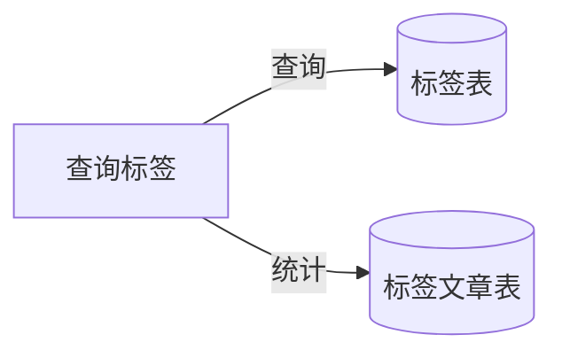

> 注：一开始测试时出现 `Failed to configure a DataSource: 'url' attribute is not specified and no embedded datasource could be configured` ，结果发现没导入 `com.alibaba.druid` 这个依赖（或者说我导入的是 `com.alibaba.druid-spring-boot-starter` ，里面包含了 `druid` ，只是导入的版本错了、导致没有下载下来），改成导入1.2.2的 `druid-spring-boot-starter` 还是有问题……所以到底哪里有问题呢？

用下面的就出错：
```xml
<?xml version="1.0" encoding="UTF-8"?>  
<project xmlns="http://maven.apache.org/POM/4.0.0" xmlns:xsi="http://www.w3.org/2001/XMLSchema-instance"  
         xsi:schemaLocation="http://maven.apache.org/POM/4.0.0 https://maven.apache.org/xsd/maven-4.0.0.xsd">  
    <modelVersion>4.0.0</modelVersion>  
    <parent>  
        <groupId>org.springframework.boot</groupId>  
        <artifactId>spring-boot-starter-parent</artifactId>  
        <version>3.0.5</version>  
        <relativePath/> <!-- lookup parent from repository -->  
    </parent>  
  
    <groupId>com.memcpy0</groupId>  
    <artifactId>myblog</artifactId>  
    <version>0.0.1-SNAPSHOT</version>  
    <name>blog-api</name>  
    <description>restful service for myblog</description>  
    <packaging>jar</packaging>  
  
    <properties>  
        <java.version>19</java.version>  
    </properties>  
  
    <dependencies>  
        <!-- 排除 Spring Boot 依赖的日志包冲突 -->  
        <dependency>  
            <groupId>org.springframework.boot</groupId>  
            <artifactId>spring-boot-starter</artifactId>  
            <!-- 排除 默认使用的logback  -->  
            <exclusions>  
                <exclusion>  
                    <groupId>org.springframework.boot</groupId>  
                    <artifactId>spring-boot-starter-logging</artifactId>  
                </exclusion>  
            </exclusions>  
        </dependency>  
  
        <!-- Spring Boot的Spring Web MVC集成 -->  
        <dependency>  
            <groupId>org.springframework.boot</groupId>  
            <artifactId>spring-boot-starter-web</artifactId>  
        </dependency>  
  
        <!-- 测试 -->  
        <dependency>  
            <groupId>org.springframework.boot</groupId>  
            <artifactId>spring-boot-starter-test</artifactId>  
            <scope>test</scope>  
        </dependency>  
  
        <dependency>  
            <groupId>org.springframework.boot</groupId>  
            <artifactId>spring-boot-devtools</artifactId>  
            <scope>runtime</scope>  
        </dependency>  
  
        <!-- log4j2 -->  
        <dependency>  
            <groupId>org.springframework.boot</groupId>  
            <artifactId>spring-boot-starter-log4j2</artifactId>  
        </dependency>  
        <!-- aop -->  
        <dependency>  
            <groupId>org.springframework.boot</groupId>  
            <artifactId>spring-boot-starter-aop</artifactId>  
        </dependency>  
  
        <dependency>  
            <groupId>org.springframework.boot</groupId>  
            <artifactId>spring-boot-starter-cache</artifactId>  
        </dependency>  
  
        <!-- jpa -->  
<!--        <dependency>-->  
<!--            <groupId>org.springframework.boot</groupId>-->  
<!--            <artifactId>spring-boot-starter-data-jpa</artifactId>-->  
<!--        </dependency>-->  
  
        <!-- 邮件 -->  
        <dependency>  
            <groupId>org.springframework.boot</groupId>  
            <artifactId>spring-boot-starter-mail</artifactId>  
        </dependency>  
  
<!--        <dependency>-->  
<!--            <groupId>org.springframework</groupId>-->  
<!--            <artifactId>spring-webmvc-portlet</artifactId>-->  
<!--        </dependency>-->  
  
        <!-- lombok，简化类的构建-->  
        <dependency>  
            <groupId>org.projectlombok</groupId>  
            <artifactId>lombok</artifactId>  
        </dependency>  
  
        <!-- 接口文档 -->  
        <!-- Spring Boot 集成 swagger -->        <dependency>  
            <groupId>com.spring4all</groupId>  
            <artifactId>swagger-spring-boot-starter</artifactId>  
            <version>1.9.0.RELEASE</version>  
        </dependency>  
  
        <!-- redis -->  
        <dependency>  
            <groupId>org.springframework.boot</groupId>  
            <artifactId>spring-boot-starter-data-redis</artifactId>  
        </dependency>  
  
        <!-- JSON解析工具 -->  
        <dependency>  
            <groupId>com.alibaba</groupId>  
            <artifactId>fastjson</artifactId>  
            <version>1.2.44</version>  
        </dependency>  
  
        <!-- druid 连接池管理 -->  
        <dependency>  
            <groupId>com.alibaba</groupId>  
            <artifactId>druid-spring-boot-starter</artifactId>  
            <version>1.2.2</version>  
        </dependency>  
<!--        <dependency>-->  
<!--            <groupId>com.alibaba</groupId>-->  
<!--            <artifactId>druid</artifactId>-->  
<!--            <version>1.2.2</version>-->  
<!--        </dependency>-->  
  
        <!-- mysql驱动 -->  
        <dependency>  
            <groupId>mysql</groupId>  
            <artifactId>mysql-connector-java</artifactId>  
            <version>8.0.27</version>  
        </dependency>  
  
        <!-- mybatis plus 集成Spring Boot启动器 -->  
        <dependency>  
            <groupId>com.baomidou</groupId>  
            <artifactId>mybatis-plus-boot-starter</artifactId>  
            <version>3.4.2</version>  
        </dependency>  
  
<!--        <dependency>-->  
<!--            <groupId>org.apache.shiro</groupId>-->  
<!--            <artifactId>shiro-core</artifactId>-->  
<!--            <version>1.10.0</version>-->  
<!--        </dependency>-->  
  
<!--        <dependency>-->  
<!--            <groupId>org.apache.shiro</groupId>-->  
<!--            <artifactId>shiro-spring</artifactId>-->  
<!--            <version>1.10.0</version>-->  
<!--        </dependency>-->  
  
        <dependency>  
            <groupId>org.springframework.boot</groupId>  
            <artifactId>spring-boot-configuration-processor</artifactId>  
            <optional>true</optional>  
        </dependency>  
  
        <dependency>  
            <groupId>org.apache.commons</groupId>  
            <artifactId>commons-lang3</artifactId>  
            <version>3.12.0</version>  
        </dependency>  
  
        <dependency>  
            <groupId>commons-collections</groupId>  
            <artifactId>commons-collections</artifactId>  
            <version>3.2.2</version>  
        </dependency>  
    </dependencies>  
  
    <build>  
        <plugins>  
            <plugin>  
                <groupId>org.springframework.boot</groupId>  
                <artifactId>spring-boot-maven-plugin</artifactId>  
            </plugin>  
        </plugins>  
    </build>  
</project>
```
后来将上面的 `java.version` 改成1.8，模块JDK的语言级别改成：8. lambda、类型注解等 ... ，Druid连接池改为1.1.23版，就可以通过测试了。不过我也不太清楚怎么通过的……
 
> 编译时错误: 无效的目标发行版：20 ——编译时，使用的是Java 19版本，实际上编译时依赖的却不是JDK 19版本。
> 日志报错Failed to retrieve application JMX service URL解决方法：https://www.cnblogs.com/lysboke/p/16183373.html 去掉了 “启用 JMX 代理”的选项


---
# 0. 通用的分页查询请求参数类和响应结果类
```java
package com.xuecheng.base.model;

import lombok.Data;
import lombok.ToString;
import lombok.extern.java.Log;

/**
 * @description 分页查询通用参数
 * @author Mr.M
 * @date 2022/9/6 14:02
 * @version 1.0
 */
@Data
@ToString
public class PageParams {

    //当前页码默认值
  public static final long DEFAULT_PAGE_CURRENT = 1L;
    //每页记录数默认值
  public static final long DEFAULT_PAGE_SIZE = 10L;

  //当前页码
  private Long pageNo = DEFAULT_PAGE_CURRENT;

  //每页记录数默认值
  private Long pageSize = DEFAULT_PAGE_SIZE;

  public PageParams(){

  }

  public PageParams(long pageNo,long pageSize){
      this.pageNo = pageNo;
      this.pageSize = pageSize;
  }
}
```

响应结果包装类：


内嵌的分页结果：
```java
package com.xuecheng.base.model;

import lombok.Data;
import lombok.ToString;

import java.io.Serializable;
import java.util.List;

/**
 * @description 分页查询结果模型类
 * @author Mr.M
 * @date 2022/9/6 14:15
 * @version 1.0
 */
@Data
@ToString
public class PageResult<T> implements Serializable {

    // 数据列表
    private List<T> items;

    //总记录数
    private long counts;

    //当前页码
    private long page;

    //每页记录数
    private long pageSize;

    public PageResult(List<T> items, long counts, long page, long pageSize) {
        this.items = items;
        this.counts = counts;
        this.page = page;
        this.pageSize = pageSize;
    }
}
```
我们发现此模型类中定义了List属性，此属性存放数据列表，且支持泛型


---
# 1. 标签管理模块
因为文章需要标签，所以先完成这一个模块。
## 1.1 标签查询
### 1.1.1 需求分析
由于是个人博客，标签和专栏的数量都不会很多，专栏数量不会超过500，标签数量也不会有好几千。因此查询时就很简单：
- 给文章选择标签时，查询全部标签。参考下面：
	
- 在标签页，可以查看到所有标签，和标签对应的文章总数。
- 查询最热标签（哪些标签的文章被访问的次数最多？），这一功能暂不确定实现？
### 1.1.2 业务流程
用户在上传文章/创建文章后进行发布，需要选择标签。
或者在进入标签界面时，也会看到全部标签及其对应文章数。
在博客主页还能看到最热标签？

### 1.1.3 数据模型
标签查询功能涉及的数据表有标签表 `blog_tag` 、标签文章表 `blog_article_tag` ，如下图：


下边从查询条件、查询列表两个方面进行分析：
1、查询条件：无（即查询全部标签）。
① 查询全部时，默认按照标签名排序。
② 查询全部标签及对应文章数时，按照每个标签下文章总数排名。
③ 查询最热标签时，按照每个标签下文章浏览数排名，并固定取前10个标签。
无需分页查询。

2、查询结果：
① 标签ID、标签名、标签图？
② 标签ID、标签名、标签图，每个标签下文章数。
③ 标签ID、标签名、标签图。
从结果上看基本来源于标签表，文章和浏览数需要关联标签文章表查询。
### 1.1.4 数据模型对应的PO类
```java

```
### 1.1.5 接口定义
定义一个接口需要包括以下几个方面：
1）协议：通常协议采用HTTP+Restful风格，本接口使用HTTP POST。

还要确定Content-Type，**请求参数以什么数据格式提交，响应结果以什么数据格式响应**。一般情况没有特殊情况结果以JSON格式响应。
2）确定请求参数：根据前边对数据模型的分析，请求参数为：type=?，分别对应上述三个功能。**不用根据分析的请求参数定义请求模型类**。
3）确定响应结果：根据前边对数据模型的分析，**响应结果为标签列表**，列表中数据的属性包括：标签ID、标签名、标签图片URL、每个标签下文章数（不用时为0）。标签列表隐含展示的顺序。
接口如下：
```json
GET /blog/tags/details?type=1
GET /blog/tags/details?type=2
GET /blog/tags/details?type=3
Content-Type: application/json
# 成功响应结果
{
  "code": 200,
  "msg": "成功了",
  "data": {
	  "tags": {
		  "id": ,
		  "tagName":
		  "image":
		  "counts":
	  }
  }
}
```
### 1.1.6 接口开发
4）分析完成，使用SpringBoot注解开发一个Http接口——Controller方法（可使用SpringBoot注解在Controller类中实现）。
4）接口请求示例
```java
/**
 * @description 课程信息编辑接口
 * @author Mr.M
 * @date 2022/9/6 11:29
 * @version 1.0
 */
 @Api(value = "课程信息编辑接口",tags = "课程信息编辑接口")
 @RestController
public class CourseBaseInfoController {

  @ApiOperation("课程查询接口")
 @PostMapping("/course/list")
  public PageResult<CourseBase> list(PageParams pageParams, @RequestBody QueryCourseParamsDto queryCourseParams){

      return null;
  }
}
```
```

### 1.1.7 
5）**使用接口文档工具查看接口的内容**。
6）接口中调用Service方法完成业务处理。


## 1.2 新增标签
用户在上传文章/创建文章后进行发布，需要选择标签。如果标签不存在，则要添加文章标签。


---
# 2. 专栏管理模块
因为文章需要专栏，所以先完成这个模块。由于是个人博客，标签和专栏的数量都不会很多，专栏数量不会超过500，标签数量也不会有好几千。因此查询时就很简单：
- 给文章选择专栏时，查询全部专栏。参考下面：
	

### 1.2.2 业务流程


### 1.2.3 数据模型


### 1.2.4 实现代码


## 1.2 新增标签


---
# 3. 文章管理模块
## 1.1 文章查询
### 1.1.1 需求分析
观看者（我或其他游客）进行首页，点击文章进入文章查看界面。参考CSDN的相关功能：

要实现的查询操作包括：
- 按输入关键字（这里用ElasticSearch），搜索文章标题和内容。当不输入查询条件时输入全部课程信息。输入查询条件查询符合条件的课程信息。约束：本教学机构查询本机构的课程信息。
- 按最后发布时间排序（这里是按更新时间，每次更新后都是“重新”发布，因此是**最新文章**）；。类似地有一个时间轴信息
	
- 按浏览量排序（**最热文章**），以及博客主页的最新10篇文章；
- 按评论数排序；
- 按创作历程（这里是按文章创建时间，或者说是第一次上传发布时间），创作历程中还会按照月份分类计数：

- 根据标签查询相关文章
- 根据专栏查询相关文章

## 1.2 新增文章 


## 1.3 删除文章


---
### 2.1.1 业务流程

## 1.1 数据层模型类 `Article`
本来想自动生成，发现有点麻烦。要自己手写代码生成器……就算生成了也要自己配置相关MybatisPlus注解。


JRS校验

和持久化层代码

---
#


---
# 运行

将项目clone到本地

## 方式一  直接运行SpringBoot项目（已将打包的静态文件放到了 resources/static下）
1. 将blog-api导入到IDE工具中
2. resources/sql/blog-schema.sql、blog-data.sql导入MySQL数据库
3. 打开Redis数据库
4. resources/application.properties 修改MySQL、Redis连接
5. Runas运行,访问：http://localhost:8888

## 方式二  前后分离（开发方式）
1. 按方式一运行blog-api，提供api数据接口
2. 打开命令行
	> cd blog-app

	> npm install

	> npm run dev

3. 访问：http://localhost:8080
4. 修改blog-app/src 下的文件进行开发
5. npm run build 生成最终静态文件


# 博客前端

> 更新历史

## 2018-01-04

```
# 使用vue的Webpack模板生成脚手架
```

## 2018-01-05

```
# 引入ElementUI

# babel-plugin-component自定义主题
# 首页
# 登陆页
# 注册页面
# 日志页
```
## 2018-01-07

```
# 调整底部栏始终固定在底部
# 日志页 添加时间轴
# 首页的文章列表
```
## 2018-01-08

```
# 使用组件-博客作者tab页
# 添加第三方图标
```

## 2018-01-09

```
# 调整顶部导航栏：激活文字颜色，click点击
# 组件-最新文章tab页

# 最新文章、最热文章使用相同组件
# 底部栏设计
# 页面与两边边距改为100
```

## 2018-01-10

```
# 写博客 引入mavonEditor编辑器
# 顶部导航栏都放入一个Menu中
# 写文章页面
#　mavonEditor局部引入

#　页面的中间区域固定宽度，自动居中
# 发布和取消
# 发布dialog

```
## 2018-01-11

```
# 文章组件用守卫来改变body背景色
# 调整登陆和注册页面，使其居中

#子页面调整根元素为div
#文章详情页

```
## 2018-01-12

```
# 文章详情页  内容  评论等

```
## 2018-01-13

```
## 重新调整页面结构
	#顶部和底部 抽成  BaseHeader BaseFooter 组件
	#BlogView为单独页，以前是Home的子路由

```
## 2018-01-15

```
# 文章分类去掉子级
# 将首页的文章列表抽成 ArticleItem组件
# 增加文章的评论展示
# 增加文章分类、标签页

```

## 2018-01-15  2

```
# 回到顶部去掉过渡动画（影响顶部导航栏）
# 顶部导航栏 增加登录后菜单
# 首页增加 最热标签
# 增加 文章分类 标签的详情页
# 将文章详情页、 文章分类标签页 改为Home的子路由（以前单独页）
# Home组件增加路由判断：更正导航栏的状态、条件显示底部栏

```

## 2018-01-16

```
# 将写文章的顶部Header合并到BaseHeader中
# 图片都放到了static目录下

```

## 2018-01-24

```
# 将自定义的theme放到assets下
# 加入axios
# 加入vuex
# 实现登录
# 实现退出

```

## 2018-01-25

```
# 实现注册逻辑
# 写文章功能实现
# 写文章时支持插入图片

```
## 2018-01-26

```
# 引入lodash工具类
# 优化写文章的工具栏：滚动时固定顶部
# 写文章 后台获取文章分类和标签

# 首页的文章列表

```

## 2018-01-27

```
# 修改首页文章列表的样式
# 首页加载文章功能
# 文章查看功能
# 文章分类和标签功能列表

```

## 2018-01-28

```
# 文章分类和标签详情

```

## 2018-01-29

```
# 文章分类和标签的文章数
# 首页最热文章
# 首页最新文章
# 首页最热标签

```
## 2018-01-30

```
# BaseHeader放回views中
# 修改Axios后置拦截，全局处理错误
# 将登录 退出 和头像 放到一起

```
## 2018-01-31

```
# 文章发表评论功能
# 用户默认头像
# 整理代码

```
## 2018-01-31 2

```
# proxyTable接口转发
# webpack模块按需加载(路由组件)

```

## 2018-04-14 ~ 2018-04-20 重要修改

```
# 首页 文章分类 标签中的文章列表增加滑动分页
# 增加文章归档功能
# 格式化代码

```


## 2018-04-28

```

# 文章 评论的时间格式化显示
# 修改一些显示样式：最热标签等

# 文章详情添加所属 标签 文章分类的显示
# 文章编辑功能

# 对评论进行回复

```
