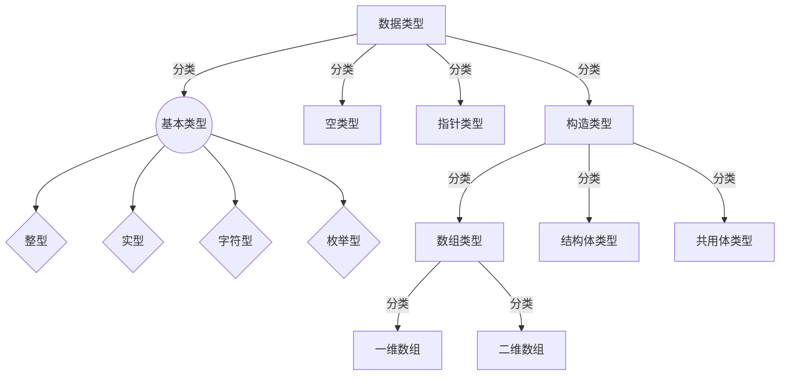

@[toc]
# C知识精华总结
> 在经过一番学习和思考后，我发现，C语言的语法**真正重要的地方在于数据类型与运算符优先级结合性**，原定的全面的总结我觉得缺乏意义，就不写了，这里就只写我认为最重要的地方。
## 1. 运算符优先级与结合性
在一个表达式中可能包含多个由不同运算符连接起来的、具有不同数据类型的数据对象，不同的求值和结合顺序可能得出不同结果，甚至出现运算错误。我们按一定顺序进行结合，才能保证运算的合理性和结果的正确性、唯一性。
表达式的结合次序取决于表达式中各种运算符的优先级。优先级高的运算符先结合，优先级低的运算符后结合，同一行中的运算符的优先级相同。

### 1.1 常量、变量、标识符
- 标识符：一个名称，用来表示常量、变量、函数和文件等名称。**合法的标识符由大小写字母、下划线、数字组成，必须以字母或下划线开头，大小写敏感**。
- 关键字：被C语言保留、不能用作其他用途的一些标识符，它们用作程序中的固定含义。
  > 保留字：被某一门程序语言保留的、不能用作其他用途的一些标识符，可能没有在程序中代表固定的含义。
  
 - 常量：包括整型常量、实型常量、字符型常量、符号常量。
    (1). 整型常量：不带小数点的数字表示；
    (2). 实型常量：用带小数点的数字表示；
    (3). 字符型常量：用带有**单引号**的字符表示。
    (4). 符号常量：使用一个宏定义的标识符表示一个常量，其值和类型都是由符号常量的定义命令决定的。`#define 标识符 常量`，一经定义，后面在程序中所有出现该标识符的地方都会在预处理阶段被(字符上)替换成该常量。此时，不能再用赋值语句对符号常量重新赋值。习惯上符号常量使用**大写表示**。
    > #define LENGTH 10 ...LENGTH = 20; 是错的，因为预处理后该程序会变成20=20。
 
- 变量：`数据类型 变量名1, [变量名2,...];` 先定义后使用。其初始化可以在定义时或在之后。
### 1.2 基本数据类型
- 数据类型：程序语言给其使用的数据指定的某种数据组织形式，**从字面上就是对数据按照类型进行分类**。因此，数据类型代表了数据的性质、表示形式、占据存储空间的大小等。
- C语言中的数据类型：基本型都很简单，但加上指针类型后就变得很复杂，加上构造类型后就更加复杂，这是个C语言的重难点所在。我会认真总结一下的。

- 整型数据：
  (1). 整型变量(这里是VC6.0的标准；基本类型说明符是int，即Integer，**一般省略不写int**；符号类型默认是有符号，**一般省略不写signed**，而且像Java就禁用了无符号类型；最常用的是int和long，**基本不用short**)。
  定义：`类型说明符 变量名1,【变量名2, ...】;`
  分类：
  |类型说明符|类型|分配字节数|范围|
  |:--|:--|:--|:--| 
  |[signed] short [int] | 有符号短整型| 2 | `-32768至32767`，即(-2^15^~2^15^-1) |
  |[signed] int|   有符号基本整型|      4 | `-2147483648至2147483647`，即(-2^31^~2^31^-1) |
  |[signed] long [int] | 有符号长整型| 4 |  `-2147483648至2147483647`，即(-2^31^~2^31^-1) |
  |unsigned short [int] | 无符号短整型| 2 | `0至65535`，即(0~2^16^-1) |
  |unsigned int |  无符号基本整型| 4 | `0至4294967295`，即(0~2^32^-1) |
  |unsigned long [int] | 无符号长整型| 4 |`-0至4294967295`，即(0~2^32^-1) |
  (2). 整型常量：即为字面上的整常数，其中**只有10进制整常量有正负，8进制和16进制无负数(只能为无符号数)**，表示方法如下：
	|表示法类型| 数码| 要求|示例|
	|:--|:--|:--|:--|
	|八进制表示法| 0-7| 以0作为前缀，还可以U/u作为后缀|  014、0102|
	|十进制表示法| 0-9| 无前缀，可以U/u作为后缀 |  237、589|
	|十六进制表示法| 0-9 和 A-F | 以0X作为前缀，还可以U/u作为后缀| 0X2A、0XA0|
  
- 实型数据：(包括小数形式和指数形式)
  (1). 实型变量(这里是VC6.0的标准；最常用的是double和float，**一般不用long double**)：
  定义：`类型说明符 变量名1,【变量名2, ...】;`
  分类：
  |类型说明符|类型|分配字节数|有效位数|取值范围
  |:--|:--|:--|:--|:--|
  |float| 单精度浮点数| 4 |  6-**7位**| -3.4x10^-38^~3.4x10^38^|
  |double| 双精度浮点数| 8 | 15-**16位**| -1.7x10^-308^~1.7x10^308^|
  |long double| 长双精度浮点数| 16 | 18-19位| -1.2x10^-4932^~1.2x10^4932^|
  (2). 实型常量：均为有符号浮点数，没有无符号浮点数；有十进制小数形式和指数形式。
  |表示形式| 要求| 示例|
  |:--|:--|:--|
  |十进制小数形式| 由数字和小数构成，**必须有小数点，小数点的位置不受限制**| 3.14、0.123、300.和.123|
  |指数形式| 由**十进制数(小数/整数)**+阶码标志e或E+**整数阶码**构成，小数点左边只有一位非零数字的形式是规范化的指数形式| 1.134e1、11.34e0、1.E4、10E3|

- 字符型数据：用来处理文本信息，表示英文字母、符号和汉字的数据。
  (1). 字符变量：占1个字节，实质上是一个8位的整数值，有符号字符型范围是-128~127，无符号字符型是0至255。字符值以ASCII码值的形式存放在变量的内存单元之中，令`ch='a'`其实是在相应存储单元中存放97的二进制代码，即`ch 00100001`。
  定义：`char 变量名1,【变量名2, ...】;`
  (2). 字符常量：以一对单引号括起来的单个字符，如`'a'、'b'、'#'、'+'`等。字符常量只能用单引号括起来，不能用双引号，其中有些非图形的以"\\"开头的转义字符，列举如下。或者，我们也可以使用其10进制的ASCII码值来表示，如用`65表示'A'`。
  |十进制ASCII码值| 字符形式| 功能|
  |:--|:--|:--|
  |0| `\v ` | 空操作|
  |8|  `\b`  | 退格|
  |9|  `\t` | 水平建表|
  |10|  ` \n`   | 换行|
  |12|   ` \f ` |换页|
  |13|  ` \r ` |回车|
  | 34|  `\"` | 双引号|
  | 39|   `\'` |单引号|
  | 92|    `\\`  | 反斜线|
  (3). 字符型变量的运算：就是把字符型数据当做较小的整型数据来运算；可以允许对整型变量赋予字符值，对字符变量赋予整型值；可以将整型变量作为字符量来输出，也可以将字符变量作为整型量来输出。
  
### 2.3 构造类型之数组类型
> 构造类型数据是由基本数据类型按照一定的规律组成的，其中的数组就可以分为整型数组、实型数组、字符数组(即字符串变量的实现)，与结构体结合还有结构体数组。
> 此外，还有一维数组和二维数组的区别。

- 数组：一组具有**相同数据类型**的数据的**有序集合**，构成该数组的成员即数据元素(数据单元)。数据元素和下标(`代表其位置和数据次序`)是数组的两个基本要素。数组中元素下标的个数就是数组维数，一个下标是一维数组，两个下标是二维数组，这也是我们最经常使用的数组结构，代表了逻辑结构和物理结构一致的顺序表。

- 一维数组：由有一个下标的数据元素组成的数组。
  定义：`类型说明符 数组名[整型字面常量/符号常量/常量表达式]`。其中的数据类型说明符可以是基本数据类型(整型、实型、字符型)，也可以是构造数据类型。常量表达式VC6.0的标准中不允许是0、负数、浮点数和变量，但是Dev C++中可以使用已赋值的变量。如果说明数组的存储类型为静态类型即`static int a[10];`则所有元素都是静态型变量。
  (1). 一维数组的初始化(在定义的时候同时为数据元素指定初值)：`类型说明符 数组名[长度] = {常量1, 常量2, 常量3, ...}`。
  > 可以不指定数组长度，由编译器自动按照初值个数确定；
  > 如果指定数组长度为N，N>初值个数，则编译器自动给余下的元素赋0值，N=初值个数则是普通写法，列出的元素初始值不能大于数组长度N；
  
  (2). 一维数组的使用：赋值：只能给元素逐个赋值，不能给数组整体赋值，可以动态地赋初值(利用循环语句)；使用：不能一次性引用整个数组，只能逐个引用数组元素，而数组作为一个整体是不能参加数据运算的(`因为数组名不是变量，而是一个内存地址常量，只有其中数据元素才是变量`)，每个数据元素就是普通的变量，可以使用其下标引用，下标的范围检查是C程序编写很重要的一部分(`下标取值范围是0~数组length-1`)，编译器不会自动检验数组元素是否越界，只有靠程序员自己注意。
  (3). 一维数组的应用：用在排序算法上，这是数据结构与算法很重要和基础的一部分内容，但二级中应该最多就考一个冒泡排序法。外层循环的J代表已经排序的元素的个数(可以推断未排序元素的个数)，内层循环的K控制的是元素比较的次数(`由length-1到j，即length-1-j`)，随着已排序部分的增多，未排序部分元素比较的次数会下降。内层循环体交换两个元素。每一次外循环，就代表一次冒泡(将最小的数据元素冒到最前面)，代表有序度的增加。
  ```C
	// 冒泡排序  从小到大 
	for (j=0; j<length; j++) {
	  	for (k=length-1; k>j; k--) {
	  		if (nums1[k] < nums1[k-1]) {
				   int temp = nums1[k];
				   nums1[k] = nums1[k-1];
				   nums1[k-1] = temp;
   ```
   
 - 二维数组：由有两个下标的数据元素组成的数组就是二维数组。逻辑上可以看做一个具有行和列的表格/矩阵。
   定义：`类型标识符 数组名[常量表达式1][常量表达式2]`，常量表达式1x常量表达式2=该数组具有的元素个数。
