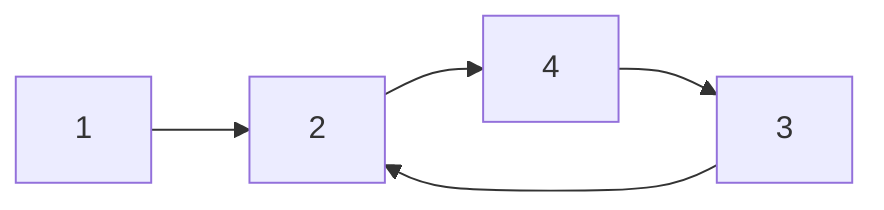

# P5318 【深基18.例3】查找文献【图的遍历,DFS,BFS】普及-
**题目描述**
小 K 喜欢翻看洛谷博客获取知识。每篇文章可能会有若干个（也有可能没有）参考文献的链接指向别的博客文章。小 K 求知欲旺盛，如果他看了某篇文章，那么他一定会去看这篇文章的参考文献（如果他之前已经看过这篇参考文献的话就不用再看它了）。

假设洛谷博客里面一共有 $n(n≤10^5)$ 篇文章（编号为 $1$ 到 $n$）以及 $m(m≤10^6)$ 条参考文献引用关系。目前小 K 已经打开了编号为 $1$ 的一篇文章，请帮助小 K 设计一种方法，使小 K 可以不重复、不遗漏的看完所有他能看到的文章。

这边是已经整理好的参考文献关系图，其中，文献 X → Y 表示文章 X 有参考文献 Y。不保证编号为 $1$ 的文章没有被其他文章引用。


请对这个图分别进行 DFS 和 BFS，并输出遍历结果。如果有很多篇文章可以参阅，请先看编号较小的那篇(因此你可能需要先排序)。

**输入格式**
共 $m+1$ 行，第 $1$ 行为 $2$ 个数，$n$ 和 $m$ ，分别表示一共有 $n(n≤10^5)$ 篇文章（编号为 $1$ 到 $n$）以及 $m(m≤10^6)$ 条参考文献引用关系。

接下来 $m$ 行，每行有两个整数 $X,Y$ 表示文章 $X$ 有参考文献 $Y$ 。

**输出格式**
共 $2$ 行。 第一行为 DFS 遍历结果，第二行为 BFS 遍历结果。

**输入输出样例**
输入#1
```cpp
8 9
1 2
1 3
1 4
2 5
2 6
3 7
4 7
4 8
7 8
```
输出#1
```cpp
1 2 5 6 3 7 8 4 
1 2 3 4 5 6 7 8
```
解法：注意必须排序，以及只看**能看到的文章**。
```cpp
#include <bits/stdc++.h>
using namespace std;
const int maxn = 1e5 + 10;
vector<int> g[maxn];
bool vis[maxn];
vector<int> ds, bs; 
int n, m;
int x, y;

void dfs(int i) {
    vis[i] = true;
    ds.push_back(i);
    for (int j : g[i]) {
        if (vis[j]) continue;
        dfs(j);
    }
}
void bfs(int i) {
    queue<int> q;
    vis[i] = true;
    q.push(i);
    while (!q.empty()) {
        int i = q.front(); q.pop();
        bs.push_back(i);
        for (int j : g[i]) {
            if (vis[j]) continue;
            vis[j] = true;
            q.push(j);
        }
    }
}

int main() {
    scanf("%d%d", &n, &m);
    for (int i = 0; i < m; ++i) {
        scanf("%d%d", &x, &y);
        g[x].push_back(y);
    }
    for (int i = 1; i <= n; ++i) sort(g[i].begin(), g[i].end());
    dfs(1);
    for (int i = 1; i <= n; ++i) vis[i] = false;
    bfs(1);
    for (int i = 0; i < ds.size(); ++i) printf(" %d" + !i, ds[i]);
    printf("\n");
    for (int i = 0; i < bs.size(); ++i) printf(" %d" + !i, bs[i]);
    return 0;
} 
```


---
# P3916 图的遍历【逆邻接表+倒序遍历+DFS】普及/提高-
**题目描述**
给出 $N$ 个点，$M$ 条边的有向图，对于每个点 $v$ ，求 $A(v)$ 表示从点 $v$ 出发，能到达的编号最大的点。

**输入格式**
第 $1$ 行 $2$ 个整数 $N,M$ ，表示点数和边数。

接下来 $M$ 行，每行 $2$ 个整数 $U_i,V_i$ ​，表示边 $(U_i,V_i)$ 。点用 $1,2,…,N$  编号。

**输出格式**
一行 $N$ 个整数 $A(1),A(2),…,A(N)$ 。

**输入输出样例**
输入 #1
```c
4 3
1 2
2 4
4 3
```
输出 #1
```c
4 4 3 4
```
**说明/提示**
- 对于 $60\%$ 的数据，$1≤N,M≤10^3$ 。
- 对于 $100\%$ 的数据，$1≤N,M≤10^5$ 。

解法：如果想对每个点做一次DFS或BFS，一次遍历复杂度为 $O(N+M)$ ，总复杂度为 $O(N(N +M))$ ，无法接受。

一个简单的优化想法是：在DFS时，当需要求 $A(u)$ 时，先设 $A(u)$ 为自己的点标号 $u$ ，然后求出它能直接到达的子节点 $v$ 的 $A(v)$ ，**将当前的 $A(u)$ 与所有 $A(v)$ 中取个最大值**。这样求出所有的 $A(v)$ 后，也得出了最后的 $A(u)$ 。==这个过程中，如果遍历到一个点的 $A(v)$ 已经被求出来了，就直接使用当前的 $A(v)$ ，避免重复的计算==。

想法很好，但有一个致命问题。当对图使用DFS时，可能搜索到**之前正在被搜索、但却没有得到答案的点**。如下图，求 $A(1)$ 时这个方法找到 $A(2)$ ，然后是 $A(4), A(3)$ ，$A(3)$ 不能得到正确的答案，因为 $A(2)$ 正在等待 $A(4)$ 的答案，它此时的 $A(2) = 2$ 并不是最后的正确结果：

为了解决出现环时，答案没有更新好的问题。可以考虑换种遍历方式：之前是让点 $v$ 去找它能到达的最大点，现在不如**让最大的点告诉哪些点能到达它**。

为此用反向边建图，然后枚举点时需要从 $n$ 到 $1$ 。从枚举的点 $u$ 出发，使用DFS或BFS遍历到的、且**没有被更新过的点 $v$** 的 $A(v) = u$ ——<font color="red"><b>因为从后往前枚举时，被更新过的点一定是用比当前数字大的点更新的</b></font>。这样就不会出现之前的问题了。

因为每个点有且只有被更新一次答案，所以时间复杂度为 $O(N+M)$ 。
```cpp
#include <bits/stdc++.h>
using namespace std;
const int maxn = 1e5 + 10;
vector<int> g[maxn];
int mxId[maxn];
int n, m;
int x, y;

void dfs(int i, int id) {
    mxId[i] = id;
    for (int j : g[i]) {
        if (mxId[j]) continue;
        dfs(j, id);
    }
}

int main() {
    scanf("%d%d", &n, &m);
    for (int i = 0; i < m; ++i) {
        scanf("%d%d", &x, &y);
        g[y].push_back(x); // 逆邻接表 
    }
    for (int i = n; i >= 1; --i) {
        // DFS过程中，将当前编号作为最大点，看能被哪些点遍历到，以此更新 
        if (mxId[i] == 0) dfs(i, i);
    }
    for (int i = 0; i < n; ++i) printf(" %d" + !i, mxId[i + 1]);
    return 0;
} 
```


---
# P1113 杂务 普及/提高-
**题目描述**
John 的农场在给奶牛挤奶前有很多杂务要完成，每一项杂务都需要一定的时间来完成它。比如：他们要将奶牛集合起来，将他们赶进牛棚，为奶牛清洗乳房以及一些其它工作。尽早将所有杂务完成是必要的，因为这样才有更多时间挤出更多的牛奶。

当然，有些杂务必须在另一些杂务完成的情况下才能进行。比如：只有将奶牛赶进牛棚才能开始为它清洗乳房，还有在未给奶牛清洗乳房之前不能挤奶。我们把这些工作称为完成本项工作的准备工作。至少有一项杂务不要求有准备工作，这个可以最早着手完成的工作，标记为杂务 $1$。

John 有需要完成的 $n$ 个杂务的清单，并且这份清单是有一定顺序的，杂务 $k\ (k>1)$ 的准备工作只可能在杂务 $1$ 至 $k-1$ 中。

写一个程序依次读入每个杂务的工作说明。计算出所有杂务都被完成的最短时间。当然互相没有关系的杂务可以同时工作，并且，你可以假定 John 的农场有足够多的工人来同时完成任意多项任务。

**输入格式**
第1行：一个整数 $n\ (3 \le n \le 10{,}000)$，必须完成的杂务的数目；

第 $2$ 至 $n+1$ 行，每行有一些用空格隔开的整数，分别表示：
- 工作序号（保证在输入文件中是从 $1$ 到 $n$ 有序递增的）；
- 完成工作所需要的时间 $len\ (1 \le len \le 100)$；
- 一些必须完成的准备工作，总数不超过 $100$ 个，由一个数字 $0$ 结束。有些杂务没有需要准备的工作只描述一个单独的 $0$。

保证整个输入文件中不会出现多余的空格。

**输出格式**
一个整数，表示完成所有杂务所需的最短时间。

**样例 #1**
样例输入 #1
```c
7
1 5 0
2 2 1 0
3 3 2 0
4 6 1 0
5 1 2 4 0
6 8 2 4 0
7 4 3 5 6 0
```
样例输出 #1
```c
23
```